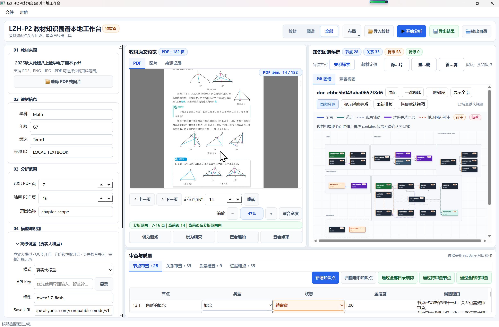
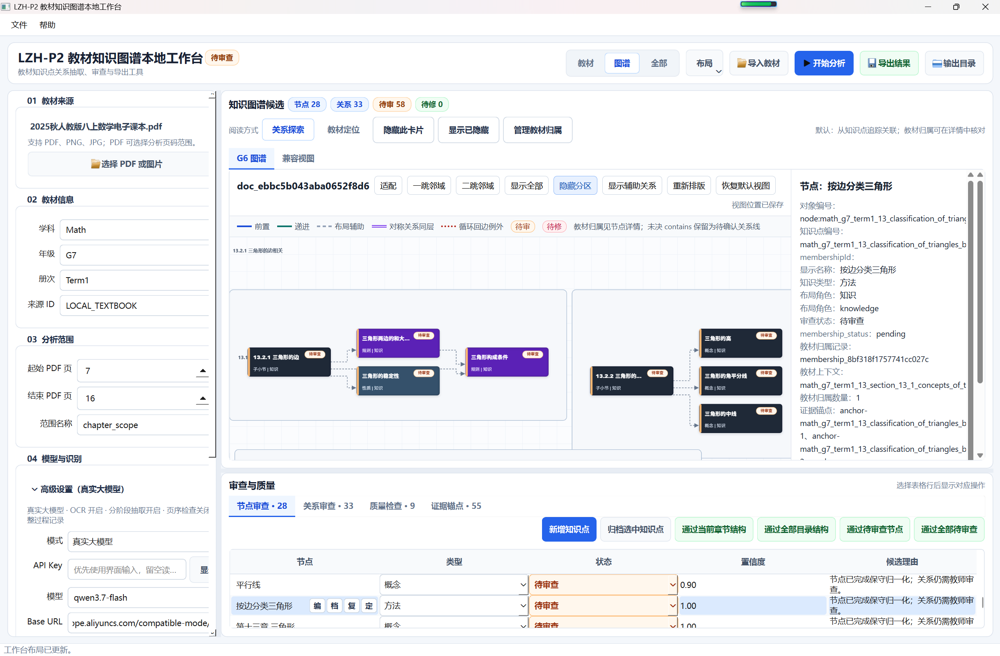
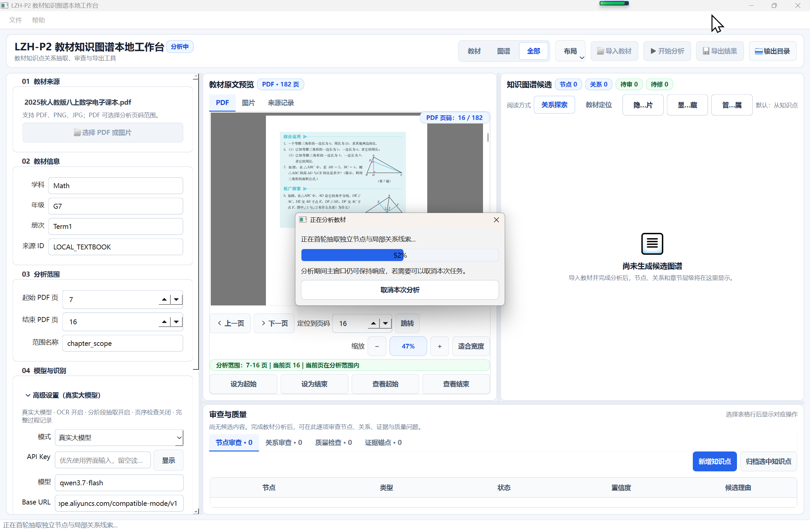
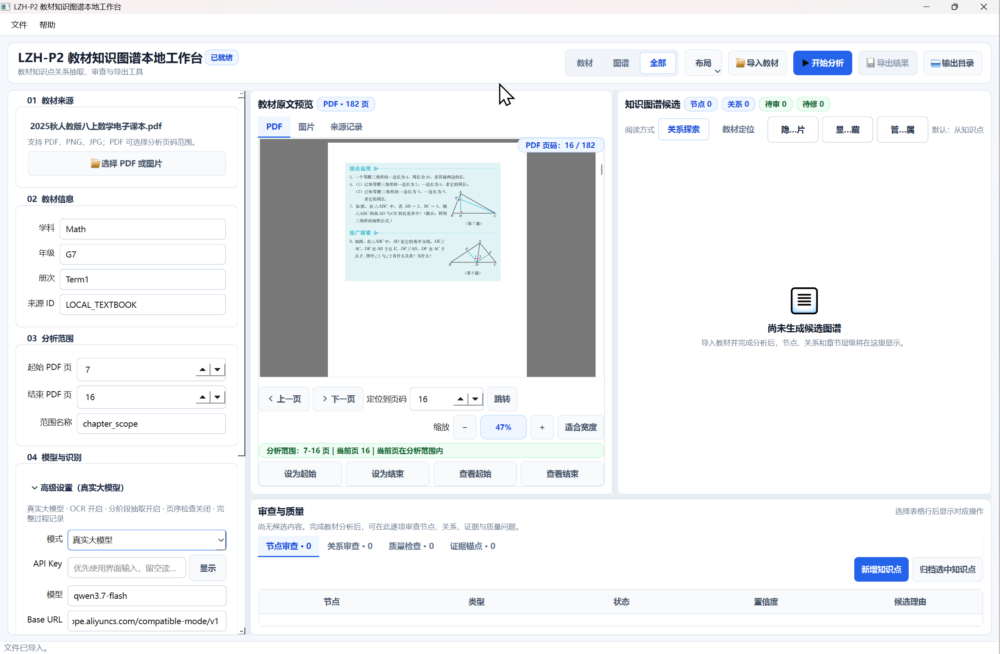
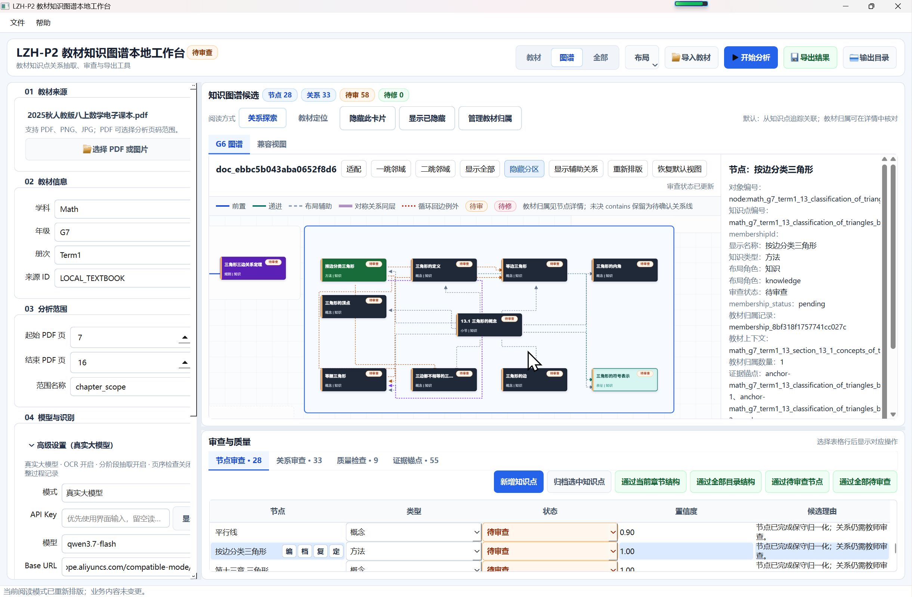

<div align="center">

# LZH-P2 教材知识图谱本地工作台

### (Textbook-Knowledge-Graph-Workbench_LZH)

<p>
  <b>简体中文</b> | <a href="README_en.md">English</a>
</p>

[](LICENSE)


<p>
  <b>以教材结构为底图，以规范知识点为核心，以类型化语义关系为价值的知识图谱建设工具。</b>
  <br />
  面向 Windows 的 K-12 教材知识建模、首轮独立抽取、单层关系分区、二维正交避障布局与教师审查工作台。
</p>

</div>

---

## 📖 为什么做这个工具？

在教育数字化与大模型应用中，市面上现有的思维导图工具与大模型自动脑图服务，已经能够将教材或教辅资料整理为层次分明的内容大纲。它们擅长完整保留材料中的章节目录、标题与段落顺序，非常适合阅读导航与内容概览。

**然而，“完整整理了一份教材”绝不等于“建立了可以参与计算的认知知识图谱”。**

教材的编排顺序通常服务于教学进度的线性展开，它无法直接回答以下关键问题：
- 哪些内容是稳定、可复用、可测评的**规范知识单元**？
- 两个知识点之间究竟是**包含、前置、递进**，还是**推导、表征、应用**关系？
- 教材先讲概念 A 后讲性质 B，是偶然的编排顺序，还是存在严格的前置依赖？
- 哪些关系直接来自教材原文证据，哪些是模型推断，哪些仍处于待教师审定的状态？

**LZH-P2 项目正是为了弥合这一鸿沟而生：**
它是一个专业的**知识图谱建设态工具**。通过“首轮独立节点抽取 + 局部关系线索 + 规范别名归一化 + 单层关系分区 + ELK 二维正交避障布局 + 审查工作台”的完整闭环，把非结构化的教材 PDF/图片转化为具有严格证据锚点、支持人机协同审查的高质量知识图谱。

---

## ✨ 可以用它做什么？

| 需求 | 对应能力 |
| :--- | :--- |
| **教材材料多格式归一化** | 支持 PDF（原生文本优先/扫描页 OCR 回退）、PNG、JPG 及结构化 JSON 规范导入与页码切片选择 |
| **提取规范知识单元** | 避免把活动、讨论和例题无差别升级为知识点；首轮独立提取概念、性质、定理等规范知识节点 |
| **挖掘丰富语义关系** | 突破单一树状包含层级，提取包含、前置、递进、推导、表征、应用、并列、对比等类型化依赖关系 |
| **双视图协同排版** | **关系探索（默认）** 与 **教材定位（辅助）** 双模式；G6 与 Qt 双端完全共用统一几何数据 |
| **教科书级二维自动布局** | 集成 Eclipse Layout Kernel (ELK) 左向右分层布局，实现单层关系分区、有序扇出与端点正交避障 |
| **人机协同可信审查** | 节点与关系逐条挂接教材页码、原文证据与置信度；支持版本历史回退与四维质量硬门禁校验 |
| **下游交付与图谱发布** | 导出规范 Excel 实体/关系表、分层映射表 `layer_mapping.json`，原子发布并直通自适应引擎 |

---

## 🖼️ 界面与核心工作流展示

### 1. 工作台全貌与双视图联动审查
工作台左侧集成自研 PDF 高保真渲染器（支持平滑缩放与指针定位），右侧集成交互式知识图谱审查器与质量列表，实现“左看教材原文证据”与“右审图谱关系属性”无缝对齐。


*工作台全貌：左侧展示电子课本原文与几何图示，右侧展示关系驱动的分层知识图谱、节点状态徽标及底部审查表格。*

### 2. 知识图谱深入审查与属性抽屉
在关系探索模式下，知识点按关联聚类为单层关系分区（Visual Relation Group）。点击任意节点即可在右侧展开属性抽屉，查看稳定对象编号、知识类型、教材归属上下文及原文证据锚点。


*图谱审查：展示“13.2.1 三角形的边”与“13.2.2 高/中线/角平分线”的分区排布，右侧抽屉实时展示选中节点的元数据与证据链。*

### 3. 异步分析流水线与实时进度反馈
点击【开始分析】后，系统进入异步非阻塞抽取状态。主窗口保持流畅响应，弹窗清晰显示当前流水线阶段（如首轮独立节点与局部关系抽取）、百分比进度，并支持随时主动取消。


*分析执行：展示后台多阶段流水线处理状态，在保证主界面可操作的同时提供精准的进度提示。*

---

## 🖥️ 快速上手

### 1. 下载并启动

下载仓库 ZIP 并解压，或克隆本仓库。在项目根目录双击：

👉 **`启动教材知识图谱工作台.cmd`**

- **系统要求**：Windows 10 / Windows 11 (x64) 与 **Python 3.10+**。
- **启动机制**：启动器采用纯 ASCII 规范，彻底消除编码错位；内置探测器自动识别 Conda 虚拟环境、激活环境或系统 Python，以 UTF-8 编码安全拉起 PySide6 桌面工作台。

启动后进入初始化工作台，界面展示教材导入引导、配置区域与待分析状态：


*启动初始化页面：可配置教材来源、学科年级册次、起始终止页码及大模型与 OCR 运行参数。*

---

### 2. 核心构建与审查流程

1. **导入教材**：在工作台点击顶部【导入教材】（快捷键 `Ctrl+O`），选择 `textbook/` 目录下的课本 PDF 或图片。
2. **设定分析范围**：在左侧面板配置起始与终止页码（推荐初次体验选择 2~3 页典型章节）。
3. **启动抽取**：点击【开始分析】（快捷键 `Ctrl+Enter`），流水线自动完成证据提取、候选生成、别名归一化与关系构建。
4. **人工审定**：在图谱画布中选中节点，核对教材原文证据；可对候选关系进行采纳、修改或驳回。
5. **质量门禁与导出**：点击【导出正式图谱】（快捷键 `Ctrl+Shift+S`），系统执行四维完整性校验后，导出规范 Excel 与 `layer_mapping.json`。

---

### 3. 命令行与手动运行

若希望使用命令行管理或集成到现有 Python 工作流中：

```powershell
# 1. 安装核心运行依赖
pip install -r requirements.txt

# (可选) 安装 Windows OCR 扩展依赖
pip install -r requirements-windows-ocr.txt

# 2. 启动桌面工作台
python run_workbench.py

# 3. 运行自动化全量测试 (102 项规范测试)
python run_project.py tests
```

---

## ⚡ 布局引擎运行时 (ELK Layout Engine)

为解决传统知识图谱连线穿卡、交叉混乱的痛点，本项目集成了 **Eclipse Layout Kernel (ELK)** 正交分层布局引擎：

- **自动识别系统 Node.js**：若您的电脑已安装 Node.js (v18+)，工作台将**自动探测并优先复用系统 Node.js**，无需做任何环境配置。
- **一键配置便携式 Node.js (免安装)**：如果您的系统未安装 Node.js，只需在 PowerShell 中运行提供的下载脚本：
  ```powershell
  .\scripts\setup_runtime.ps1
  ```
  该脚本会自动从 Node.js 官方拉取便携二进制解压到 `vendor/layout_runtime/node/node.exe`。
- **高弹性保底机制**：即使在完全没有 Node.js 的极端环境下，系统也会自动平滑降级至内置的 Python 启发式布局算法，确保界面绝不崩溃。

---

## 🛡️ 确认、数据安全与使用边界

在投入使用前，请充分了解本工具的安全机制与应用边界：

- **教材版权声明**：中小学教材受《中华人民共和国著作权法》严格保护。本项目作为知识工程与构建工具，**开源仓库中严格不分发、不附带任何具有专有版权的正式教材原件**。用户需在合法取得教材资料的前提下进行本地化科研与教学应用。
- **密钥安全与脱敏**：系统严禁在代码与仓库中硬编码任何 API Key。如需调用在线模型，请复制 `.env.example` 为 `.env` 并妥善保管您的私有密钥。
- **教师审定必要性**：大语言模型抽取的节点与语义依赖属于建设态候选。即便算法通过了四维硬门禁，正式发布前仍必须由专业学科教师依据教材原文在工作台中予以人工审定。
- **复杂关系演进说明**：针对部分超长递进链与多重反向依赖场景，自动布局引擎目前仍在持续演进迭代中（如下图所示之交叉场景），当前版本已通过单层关系分区与有序扇出大幅降低冲突率。


*布局边界与演进示例：展示在密集交叉依赖场景下的正交折线避障排布实验，算法仍在持续优化提升可读性。*

---

## 📁 项目结构与技术文档

```text
LZH-P2_Textbook-Knowledge-Graph-Workbench/
├── 启动教材知识图谱工作台.cmd         # Windows 双击一键启动器 (纯 ASCII 规范)
├── run_workbench.ps1                # PowerShell 启动核心 (带 BOM UTF-8)
├── run_workbench.py                 # 桌面工作台 GUI 启动入口
├── run_project.py                   # 命令行项目调度器 (测试 / 批处理)
├── requirements.txt                 # Python 核心依赖表
├── requirements-windows-ocr.txt     # 可选 PaddleOCR 依赖表
├── .env.example                     # 环境变量配置模板
├── LICENSE                          # MIT 开源许可证
├── README.md                        # 中文使用说明 (默认)
├── README_en.md                     # 英文使用说明
├── config/                          # 软件元信息配置 (app_info.json)
├── src/                             # 核心算法与 UI 源码
│   └── textbook_builder/
│       ├── desktop_app.py           # 工作台应用窗口与控制器
│       ├── geometry/                # ELK 与正交折线几何计算核心
│       ├── models/                  # 建设态 DTO 与数据契约
│       ├── pipeline/                # 抽取、合并与归一化流水线
│       ├── readers/                 # PDF/图像/JSON 解析器
│       ├── review_views/            # G6/Qt 双视图投影构建器
│       └── services/                # 离线/在线模型与会话服务
├── tests/                           # 自动化测试规范集 (test_*_spec.py)
├── scripts/                         # 实用脚本 (setup_runtime, 基准测试, UI抓图)
├── vendor/                          # 外部布局库与运行时脚本 (elkjs + 协议)
├── docs/                            # 体系化设计方案与技术演进报告
│   └── 相关使用截图/                # 真实系统运行高清截图
├── storage/                         # 运行时本地存储与工作底稿 (已被 .gitignore 保护)
└── textbook/                        # 用户教材放入目录 (附使用指引，无版权文件)
```

**体系化演进与设计文档阅读**：
- 基础设计：[文档导航](docs/00_文档导航.md)、[当前实现状态](docs/01_当前实现状态.md)、[系统架构与数据流](docs/02_系统架构与工作台数据流.md)、[数据契约与下游接口](docs/03_数据契约与P4接口.md)、[运行环境与安全](docs/04_运行环境配置与安全.md)、[测试验收与限制](docs/05_测试验收已知限制与下一步.md)。
- 方案与报告：[项目定位综述](docs/14_P2项目定位综述与公开介绍稿.md)、[教材归属与语义分离方案](docs/16_教材归属与知识语义分离及双视图递归布局优化方案.md)、[关系探索与二维布局实施报告](docs/19_知识点中心关系探索与二维自动布局实施完成报告_20260911.md)、[关系分区与可读性完成报告](docs/21_关系分区与左向右自动布局可读性优化实施完成报告_20260913.md)。

---

## 🧪 自动化测试

在项目根目录下执行：

```powershell
python run_project.py tests
```

测试集涵盖 23 个测试规范模块、102 项自动化检查点，全面覆盖：
- 节点/章节归一化与层级投影算法；
- 关系分区、有序扇出与端点避障硬门禁；
- 单进程批量 ELK 运行时与多连通分量求解；
- 桌面工作台交互状态机、会话撤销历史与原子提交；
- 正式图谱导出表结构与下游自适应引擎导入契约。

---

## 📄 开源许可证

本项目由 **LZH (刘钊昊)** 开发，基于 [MIT License](LICENSE) 开源。欢迎通过 GitHub Issue 反馈使用体验、问题排查与改进建议。

---

## 📮 联系作者

如果你有使用反馈、学术探讨、教育技术交流或合作需求，欢迎通过邮箱与我联系：
📧 **[comlzh@outlook.com](mailto:comlzh@outlook.com)**
